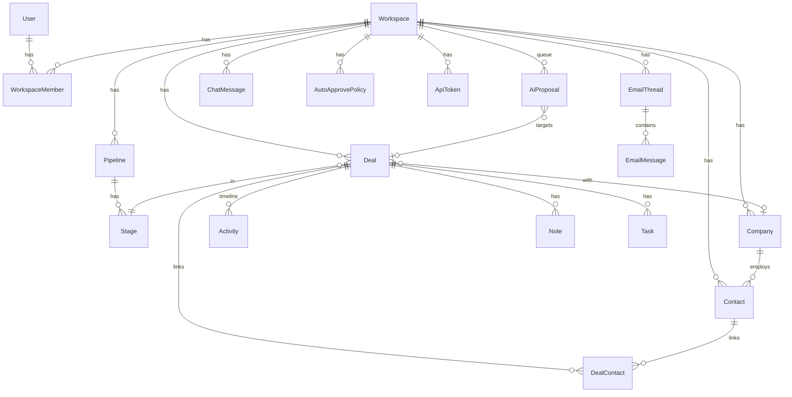

# Schema: cloneX (Octolane clone)

- version: 1
- 由来: `../teardown.md` セクション5のERを MVPスコープ(00-prd.md)に絞って具体化
- DB: PostgreSQL / ORM: Prisma

## Prisma Schema

```prisma
generator client {
  provider = "prisma-client-js"
}

datasource db {
  provider = "postgresql"
  url      = env("DATABASE_URL")
}

// ===== 認証・ワークスペース(teardown: WORKSPACE / USER)=====

model User {
  id           String   @id @default(cuid())
  email        String   @unique
  passwordHash String
  name         String
  createdAt    DateTime @default(now())
  memberships  WorkspaceMember[]
  tasks        Task[]
  chatMessages ChatMessage[]
  resolvedProposals AiProposal[] @relation("resolver")
}

model Workspace {
  id        String   @id @default(cuid())
  name      String
  createdAt DateTime @default(now())
  members   WorkspaceMember[]
  pipelines Pipeline[]
  companies Company[]
  contacts  Contact[]
  deals     Deal[]
  threads   EmailThread[]
  activities Activity[]
  notes     Note[]
  tasks     Task[]
  proposals AiProposal[]
  chatMessages ChatMessage[]
  apiTokens ApiToken[]
  autoApprovePolicies AutoApprovePolicy[]
}

model WorkspaceMember {
  id          String    @id @default(cuid())
  userId      String
  workspaceId String
  role        MemberRole @default(OWNER)
  user        User      @relation(fields: [userId], references: [id])
  workspace   Workspace @relation(fields: [workspaceId], references: [id])
  @@unique([userId, workspaceId])
}

enum MemberRole {
  OWNER
  MEMBER
}

// ===== パイプライン(teardown: PIPELINE / STAGE)=====

model Pipeline {
  id          String  @id @default(cuid())
  workspaceId String
  name        String  @default("Sales")
  isDefault   Boolean @default(true)
  workspace   Workspace @relation(fields: [workspaceId], references: [id])
  stages      Stage[]
  deals       Deal[]
}

model Stage {
  id          String  @id @default(cuid())
  pipelineId  String
  name        String
  order       Int
  probability Int     @default(0)  // 勝率0-100。加重パイプライン額の算出に使う(docs: pipelines-stages)
  isWon       Boolean @default(false)
  isLost      Boolean @default(false)
  pipeline    Pipeline @relation(fields: [pipelineId], references: [id])
  deals       Deal[]
  @@unique([pipelineId, order])
}

// ===== CRMコア(teardown: COMPANY / CONTACT / DEAL)=====

model Company {
  id          String  @id @default(cuid())
  workspaceId String
  name        String
  domain      String?
  createdAt   DateTime @default(now())
  workspace   Workspace @relation(fields: [workspaceId], references: [id])
  contacts    Contact[]
  deals       Deal[]
  @@unique([workspaceId, domain])
}

model Contact {
  id          String  @id @default(cuid())
  workspaceId String
  name        String
  email       String
  title       String?
  companyId   String?
  createdAt   DateTime @default(now())
  workspace   Workspace @relation(fields: [workspaceId], references: [id])
  company     Company? @relation(fields: [companyId], references: [id])
  dealLinks   DealContact[]
  @@unique([workspaceId, email])
}

model Deal {
  id          String  @id @default(cuid())
  workspaceId String
  pipelineId  String
  stageId     String
  name        String
  amount      Int?          // 最小通貨単位(JPY円 / USDセント)。nullは未確定
  currency    String  @default("USD")
  companyId   String?
  nextActionAt DateTime?
  createdAt   DateTime @default(now())
  updatedAt   DateTime @updatedAt
  workspace   Workspace @relation(fields: [workspaceId], references: [id])
  pipeline    Pipeline @relation(fields: [pipelineId], references: [id])
  stage       Stage    @relation(fields: [stageId], references: [id])
  company     Company? @relation(fields: [companyId], references: [id])
  contacts    DealContact[]
  activities  Activity[]
  notes       Note[]
  tasks       Task[]
  proposals   AiProposal[]
}

model DealContact {
  dealId    String
  contactId String
  role      String?   // "champion" | "decision_maker" | ... 自由文字列
  deal      Deal    @relation(fields: [dealId], references: [id])
  contact   Contact @relation(fields: [contactId], references: [id])
  @@id([dealId, contactId])
}

// ===== メール取り込み(teardown: EMAIL_THREAD / EMAIL_MESSAGE)=====
// MVPではGmail APIではなくfixtureメールボックス+取り込みAPI(03-api.md参照)

model EmailThread {
  id          String  @id @default(cuid())
  workspaceId String
  subject     String
  createdAt   DateTime @default(now())
  workspace   Workspace @relation(fields: [workspaceId], references: [id])
  messages    EmailMessage[]
}

model EmailMessage {
  id          String   @id @default(cuid())
  threadId    String
  fromEmail   String
  fromName    String?
  toEmails    Json     // string[]
  sentAt      DateTime
  bodyText    String
  processedAt DateTime?   // AIF-001処理済みマーク。nullなら未処理
  thread      EmailThread @relation(fields: [threadId], references: [id])
}

// ===== タイムライン(teardown: ACTIVITY / NOTE / TASK)=====

model Activity {
  id          String  @id @default(cuid())
  workspaceId String
  dealId      String?
  type        ActivityType
  refId       String?      // EmailMessage.id / Task.id / Note.id / AiProposal.id
  summary     String       // タイムライン1行表示用
  occurredAt  DateTime @default(now())
  workspace   Workspace @relation(fields: [workspaceId], references: [id])
  deal        Deal?   @relation(fields: [dealId], references: [id])
}

enum ActivityType {
  EMAIL
  NOTE
  TASK
  SYSTEM        // ステージ移動、フィールド更新など
  CHAT_ACTION   // チャット経由のAIアクション(フォローアップ送信等)
}

model Note {
  id          String  @id @default(cuid())
  workspaceId String
  dealId      String?
  body        String
  createdAt   DateTime @default(now())
  workspace   Workspace @relation(fields: [workspaceId], references: [id])
  deal        Deal?   @relation(fields: [dealId], references: [id])
}

model Task {
  id          String  @id @default(cuid())
  workspaceId String
  dealId      String?
  assigneeId  String?
  title       String
  dueAt       DateTime?
  status      TaskStatus @default(OPEN)
  source      TaskSource @default(USER)
  createdAt   DateTime @default(now())
  workspace   Workspace @relation(fields: [workspaceId], references: [id])
  deal        Deal?   @relation(fields: [dealId], references: [id])
  assignee    User?   @relation(fields: [assigneeId], references: [id])
}

enum TaskStatus {
  OPEN
  DONE
}

enum TaskSource {
  USER
  AI
}

// ===== AI承認ループ(teardown: AI_PROPOSAL — 製品の心臓部)=====

model AiProposal {
  id          String  @id @default(cuid())
  workspaceId String
  type        ProposalType
  status      ProposalStatus @default(PENDING)
  confidence  Float          // 0.0-1.0
  payload     Json           // typeごとの構造は下記「payload仕様」参照
  sourceType  ProposalSource
  sourceId    String?        // EmailMessage.id / ChatMessage.id
  dealId      String?        // 対象ディール(NEW_DEALの場合は承認後にセット)
  createdAt   DateTime @default(now())
  resolvedAt  DateTime?
  resolvedById String?
  workspace   Workspace @relation(fields: [workspaceId], references: [id])
  deal        Deal?   @relation(fields: [dealId], references: [id])
  resolvedBy  User?   @relation("resolver", fields: [resolvedById], references: [id])
}

enum ProposalType {
  NEW_DEAL      // 新規ディール検出(payload: name, amount?, companyName, companyDomain?, contacts[], stageName, taskTitle?)
  NEW_CONTACT   // 新規コンタクト検出(payload: name, email, title?, companyName?, dealId?)
  FIELD_UPDATE  // フィールド更新(payload: dealId, field, oldValue, newValue, reason)
  DRAFT_EMAIL   // フォローアップ草稿(payload: dealId?, contactId, subject, body, reason)
  TASK          // ネクストアクション(payload: dealId?, title, dueAt?)
}

enum ProposalStatus {
  PENDING
  APPROVED
  REJECTED
  AUTO_APPROVED
}

enum ProposalSource {
  EMAIL   // AIF-001(メール取り込み)由来
  CHAT    // AIF-003(チャット指示)由来
}

// ===== チャット(teardown: SCR-004)=====

model ChatMessage {
  id          String  @id @default(cuid())
  workspaceId String
  userId      String?     // ASSISTANTの場合null
  role        ChatRole
  content     String
  toolCalls   Json?       // AIが実行した検索/アクションのログ(表示用)
  createdAt   DateTime @default(now())
  workspace   Workspace @relation(fields: [workspaceId], references: [id])
  user        User?   @relation(fields: [userId], references: [id])
}

enum ChatRole {
  USER
  ASSISTANT
}

// ===== 自動承認ポリシー(teardown: 7-2の簡易版)=====

model AutoApprovePolicy {
  id          String  @id @default(cuid())
  workspaceId String
  proposalType ProposalType
  threshold   Float   @default(1.01)  // 1.01 = 実質無効(confidenceは最大1.0)
  enabled     Boolean @default(false)
  workspace   Workspace @relation(fields: [workspaceId], references: [id])
  @@unique([workspaceId, proposalType])
}

// ===== MCP/APIトークン(teardown: SCR-017相当。MVPでは設定画面内に統合)=====

model ApiToken {
  id          String  @id @default(cuid())
  workspaceId String
  name        String
  tokenHash   String  @unique
  createdAt   DateTime @default(now())
  lastUsedAt  DateTime?
  workspace   Workspace @relation(fields: [workspaceId], references: [id])
}
```

## payload仕様(AiProposal.payload)

型はTypeScriptで `src/lib/proposals/types.ts` に定義し、Zodでバリデーションする:

```typescript
type NewDealPayload = {
  name: string; amount?: number; currency?: string;
  companyName: string; companyDomain?: string;
  contacts: { name: string; email: string; title?: string; role?: string }[];
  stageName: string;          // 既存Stage名にマッチさせる。不一致は最初のステージ
  taskTitle?: string;         // 同時生成するネクストアクション
  reason: string;             // AIの判断根拠(UI表示用)
};
type NewContactPayload = { name: string; email: string; title?: string; companyName?: string; dealId?: string; reason: string };
type FieldUpdatePayload = { dealId: string; field: "amount" | "stageId" | "nextActionAt" | "name"; oldValue: string | null; newValue: string; reason: string };
type DraftEmailPayload = { dealId?: string; contactId: string; subject: string; body: string; reason: string };
type TaskPayload = { dealId?: string; title: string; dueAt?: string; reason: string };
```

## ER図



## シード要件(E2Eの前提)

`prisma/seed.ts` は以下を投入する:

1. デモユーザー: `demo@clonex.dev` / パスワード `demo1234`、ワークスペース「Demo Inc」
2. デフォルトパイプライン+ステージ: `Lead` → `Qualified` → `Proposal` → `Negotiation` → `Won`(isWon) / `Lost`(isLost)
3. 企業3社・コンタクト5名・ディール4件(各ステージに分散、うち1件は `updatedAt` を12日前に設定 — E2E-010「stuck deals」検証用)
4. fixtureメールボックス: `fixtures/emails/*.json`(6通: 新規リード2、既往ディールへの返信2、金額言及1、ノイズ1)
5. APIトークン1件(平文はseed出力とREADMEに記載 — MCP E2E用)
```
