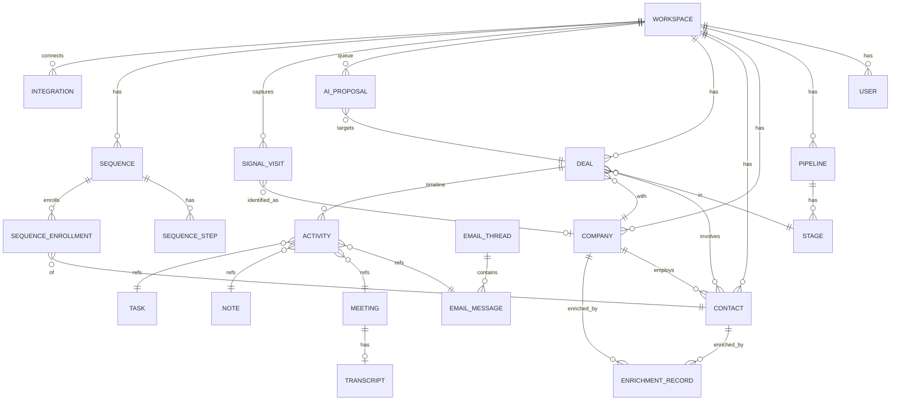

# Teardown: Octolane (Self-driving AI CRM)

- source_urls:
  - https://www.octolane.com/ (直接アクセス不可・403 — プロキシのネットワークポリシーによる)
  - https://docs.octolane.com/ (同上。検索インデックス経由で構造把握)
  - https://www.producthunt.com/products/octolane
  - https://www.ycombinator.com/companies/octolane-ai
  - https://coldiq.com/tools/octolane
  - https://theaiway.net/products/octolane/
  - https://slashdot.org/software/p/Octolane-AI/
  - https://blog.octolane.com/ai-crm-for-founder-led-sales-ultimate-guide-tool-comparison-2025/
  - https://www.globenewswire.com/news-release/2025/04/14/3061144/0/en/ (資金調達PR)
  - https://www.every.io/blog-post/the-self-driving-crm-inside-one-chowdhurys-journey-building-ai-native-crm-octolane
- date: 2026-07-17
- user_requirements: none(URLのみ。スコープ指定・除外指定なし)
- confidence: **medium** — 公式サイト/docs/アプリに直接アクセスできず(環境のネットワークポリシーで403)、
  検索エンジンのインデックス・レビューサイト・プレスリリース・公式ブログの引用からの再構成。
  機能セットは複数ソースで一致しており信頼できるが、**画面構成と正確な価格は推定を含む**。

## 1. Positioning

**「CRMに入力する」のをやめさせるプロダクト**: 創業者自身が営業する小規模チーム(1〜5人)向けに、
Gmail・カレンダー・通話を読んでCRMを自動構築・自動更新し、チャットで「Davidにフォローアップして」と
言えば実行までやる "self-driving" AI CRM。Salesforce/HubSpotの「手入力+高い運用コスト」への対抗。

- ターゲット: founder-led sales の創業者、2〜5人のGTMチーム(YC系スタートアップが中心、1,000+社が利用)
- 提供価値: ①データ入力ゼロ(passive capture)②チャット=UI(自然言語で操作)③CRM+通話録音+エンリッチ+シーケンスの4ツール統合(60–80%のコスト削減を主張)
- 会社: YC W24。$2.6Mシード(YC, Basis Set, General Catalyst Apex ほか)。創業者 One Chowdhury / Md Abdul Halim Rafi

## 2. Feature Map

- **データ自動取り込み(passive capture)** ★コア
  - Gmail / Google Calendar 連携(読み取り→ディール検出・フィールド更新・タイムライン生成)
  - ディール自動検出: 複数スレッド・複数関係者(champion/VP/調達)を1ディールに自動統合 ★
  - 自動更新: LLMが意図分類(新規リード/フォローアップ/リスク/ネクストステップ)、金額・日付・担当を抽出 ★
  - 既存CRM移行: HubSpot / Salesforce / Pipedrive をワンクリック移行(CSV・フィールドマッピング不要、30分以内)
- **AIチャット(操作の主インターフェース)** ★コア
  - 自然言語クエリ:「10日動いてないディールは?」「stuck dealsを見せて」
  - 自然言語アクション:「Davidにフォローアップ、先週の価格の質問に触れて」→ドラフト生成→承認→送信
  - スラッシュコマンド(ディール/コンタクト/メール/ミーティング/タスク横断検索)
- **承認ループ(detect → draft → enrich → approve)** ★コア
  - AI提案のレビューキュー(1クリック承認)、信頼後は自動承認しきい値を設定可能
- **ミーティングレコーダー**: Zoom / Meet / Teams に参加→録音→文字起こし→リキャップをディールに書き込み→フォローアップ草稿
- **エンリッチメント**: 250+データソース、全プランに込み(コンタクト・企業情報の自動補完)
- **Visitor Signal**: サイト訪問企業の特定(例: 今週料金ページを見た企業)、ICP適合度+インテントスコアでランク付け、CRM内既存レコードをハイライト
- **カンバンパイプライン**: ドラッグ&ドロップのディールボード(比較的新しい機能)
- **メールシーケンス/アウトリーチ**: Outreach / Salesloft / Smartlead 相当を内包(上位プランで無制限)
- **AIフィールド**: AIが値を埋めるカスタムフィールド [ASSUMED: 機能名のみ確認、詳細挙動は推定]
- **タスク / ノート**: AI生成のネクストアクション管理
- **開発者向け**: REST API、Zapier、**MCPサーバー(~60ツール、CRM機能100%カバー。Claude/ChatGPT/Cursorから接続)** ★差別化点
- 基盤: 自社モデル「Octolane Driver 3」で自律化を主張 [要確認: マーケ用語の可能性]

## 3. Screen Inventory

直接観測不可のため、機能セット・docs構成・レビュー記述からの再構成。[ASSUMED] = 存在は確実性が高いが構成は推定。

| ID | Screen | Purpose | Key UI | Nav to |
|---|---|---|---|---|
| SCR-001 | サインアップ/ログイン | Google OAuth中心の認証 | Googleでログイン、招待受諾 | SCR-002 |
| SCR-002 | オンボーディング | Gmail/Calendar接続→5分でCRM自動生成 | OAuth接続ボタン、既存CRM移行(HubSpot/SF/Pipedrive)、進捗表示 | SCR-003 |
| SCR-003 | ホーム/ダッシュボード [ASSUMED] | 今日のネクストアクション・要承認項目の集約 | AI提案カード、承認キュー概要、パイプラインサマリー | SCR-004..013 |
| SCR-004 | AIチャット ★ | 主操作面。質問・指示・スラッシュコマンド | チャット入力、/コマンドパレット、実行プレビュー、承認ボタン | 全画面 |
| SCR-005 | パイプライン(カンバン) ★ | ディールをステージ別に俯瞰・DnD | カンバン列(ステージ)、ディールカード、金額集計 | SCR-006 |
| SCR-006 | ディール詳細 ★ | 1ディールの全コンテキスト | タイムライン(メール/会議/ノート統合)、AIフィールド、関係者、次アクション、リキャップ | SCR-004,007,009 |
| SCR-007 | コンタクト一覧/詳細 | 人物レコード | エンリッチ済みプロフィール、所属、活動履歴 | SCR-006,008 |
| SCR-008 | 企業一覧/詳細 | 企業レコード | エンリッチデータ、関連ディール/コンタクト | SCR-006,007 |
| SCR-009 | ミーティング | 録音・文字起こし・リキャップ | レコーディング一覧、トランスクリプト、AI要約、フォローアップ草稿 | SCR-006 |
| SCR-010 | 承認キュー(Review) ★ | AI提案の一括レビュー | 提案カード(フィールド更新/ドラフト/新規ディール)、1クリック承認/却下、自動承認しきい値 | SCR-006 |
| SCR-011 | Signal(訪問企業) | サイト訪問シグナル | 訪問企業リスト、ICPスコア、インテントスコア、ページ別フィルタ、CRM既存バッジ | SCR-008 |
| SCR-012 | シーケンス [ASSUMED] | メールシーケンス作成・実行 | ステップエディタ、送信スケジュール、返信検知 | SCR-007 |
| SCR-013 | タスク | ネクストアクション管理 | AI生成タスク、期日、完了チェック | SCR-006 |
| SCR-014 | インボックス/メール [ASSUMED] | 同期済みメールの閲覧・送信 | スレッドビュー、AI草稿、送信 | SCR-006,007 |
| SCR-015 | 設定: 連携 | Gmail/Calendar/CRM移行/Zapier管理 | 接続状態、再認証、移行ウィザード起動 | SCR-002 |
| SCR-016 | 設定: ワークスペース/メンバー | シート管理(Pro=3席まで) | メンバー招待、権限 | - |
| SCR-017 | 設定: API/MCP | 開発者向け | APIキー発行、MCPサーバー接続情報 | - |
| SCR-018 | 設定: 課金 | プラン管理 | プラン表示、アップグレード | - |

## 4. User Flows

- **F1 オンボーディング(15分でCRMが立ち上がる)**: SCR-001 → SCR-002(Gmail/Cal OAuth)→ バックグラウンドでメール履歴スキャン → SCR-003(自動生成されたディール・コンタクトが並ぶ)→ SCR-010(初回の検出結果を承認)
- **F2 自動更新ループ(製品の心臓部)**: [新着メール/会議] → 意図分類・抽出 → 既存レコードへマッピング → SCR-010 承認キュー(または自動承認)→ SCR-006 タイムライン反映
- **F3 チャット操作**: SCR-004「Davidにフォローアップして、先週の価格の質問に触れて」→ AIが文脈(SCR-006相当)を読んで草稿 → プレビュー承認 → Gmail送信 → タイムライン記録
- **F4 ミーティング→フォローアップ**: カレンダー予定検知 → レコーダーがZoom/Meet/Teams参加 → SCR-009 文字起こし+リキャップ → SCR-006 に自動記録 → フォローアップ草稿 → SCR-010 承認
- **F5 シグナル→アウトリーチ**: SCR-011 料金ページ訪問企業を検知 → ICP/インテントでランク → エンリッチ → SCR-012 シーケンス投入 or SCR-004 でアウトリーチ指示

## 5. Data Model (estimated)

- `AI_PROPOSAL`(承認ループ)が最重要エンティティ: type(field_update / draft_email / new_deal / new_contact / task)、
  status(pending / approved / rejected / auto_approved)、confidence、source(email_id / meeting_id)を持つ [ASSUMED: 挙動記述からの逆算]
- カスタムフィールド(AI Fields)は EAV or JSONB で保持 [ASSUMED]

## 6. Pricing

| プラン | 価格 | 対象 | 含まれるもの |
|---|---|---|---|
| Pro | **$49/席/月**(一部ソースは$39 [要確認]) | 創業者セールス、最大3席 | Gmail/Cal同期、ディール自動検出、AIフィールド、AIチャット、ミーティングレコーダー、Signal、エンリッチ、Zapier、REST API、MCP |
| Business | $79 または $99/席/月 [要確認] | フルGTMチーム | + AIの自動更新・フォローアップ自動送信 |
| Team | 価格不明 [要確認] | レベニュー組織 | + AIエージェントのマルチステップワークフロー、無制限シーケンス |
| Enterprise | 問い合わせ | コンプラ要件企業 | + 自社データでのファインチューニング、SSO/SAML |

- 課金トリガー: シート数+プラン階層。エンリッチ・録音・シーケンスを別売りにしない「4ツール統合」が価格の物語
- 一部レビューに「$1,000/月〜」の記述あり — 旧価格か年間契約の誤読と推定 [要確認]

## 7. AI-Native Opportunities

Octolane自体がAIネイティブだが、クローンでさらに「AIが主語」に寄せられるポイント:

1. **MCPファースト・アーキテクチャ**: Octolaneは後付けでMCPサーバー(~60ツール)を提供。クローンは**内部UIも同じMCPツール層を叩く**設計にし、「人間用UI = AIエージェント用APIの1クライアント」に格下げする。E2EテストもMCP経由で書ける
2. **承認キューの学習化**: Octolaneは静的な自動承認しきい値。クローンは承認/却下の履歴から**提案タイプ×確信度ごとに自動でしきい値を学習**し、「使うほど自動承認率が上がる」体験にする(passive captureの承認版)
3. **コンテキストレイヤー接続**: メール・会議だけでなく、Slack/GitHub/請求(Stripe)をコンテキストソースとして繋ぎ、「実装が進んでいるのに商談が止まっている」「請求失敗した顧客のディールが更新されていない」のような**クロスソース矛盾検知**をAIが能動的に指摘
4. **デイリー自律実行(agent-run standup)**: 毎朝エージェントが全パイプラインを巡回し「今日やるべき3アクション+根拠+ワンクリック実行」を生成。ダッシュボードを「見る場所」から「承認する場所」に変える
5. **会話ログ→スキーマ進化**: ユーザーがチャットで繰り返し聞く質問(例:「先週のデモ後に返信ない人は?」)を検知し、AIが**保存ビュー/カスタムフィールド/ワークフローを自動提案・自動生成**する
6. **シグナルの自律追跡**: Visitor Signalを「表示するだけ」でなく、ICP合致訪問者に対しエンリッチ→パーソナライズ草稿→承認キュー投入までを無人で完結

## 8. Copy / Drop / Change

**Copy(そのまま真似る)**
- Gmail/Calendar接続→CRM自動生成のオンボーディング(15分体験がプロダクトの核。理由: 最大の差別化かつ習慣化装置)
- detect→draft→approve の承認ループUI(理由: AI CRMの信頼獲得メカニズムとして完成度が高い)
- チャット+スラッシュコマンドを主インターフェースにする設計(理由: ポジショニングの本体)
- カンバンパイプライン+ディール詳細のタイムライン統合ビュー(理由: CRMとしての最低限の可視性)
- 「4ツール込み」のシンプルなシート課金(理由: 対Salesforce/HubSpotの物語として機能)

**Drop(MVPでは捨てる)**
- ミーティングレコーダーのボット参加(Zoom/Meet/Teams参加は技術・審査コストが重い。文字起こしファイルのアップロード/貼り付けで代替)
- 既存CRM移行(HubSpot/SF/Pipedrive API連携はMVP後。理由: 新規ワークスペース開始で価値検証は可能)
- Visitor Signal(IPリバースルックアップは外部データ契約が必要。理由: コア価値でない)
- ネイティブZapier連携、ファインチューニング、SSO/SAML(Enterprise向け)
- メールシーケンス(理由: 単体で大きなサブシステム。フォローアップ草稿で当面代替可能)

**Change(変える)**
- MCPファースト化: UIとAIが同一ツール層を共有(→ セクション7-1)
- 承認しきい値の学習化(→ 7-2)
- Gmail依存を抽象化: メールプロバイダをアダプタ化し、デモ/E2Eでは**擬似メールボックス(fixture)**を注入可能にする(理由: E2Eテスト全通過という本パイプラインのDoDに直結)
- 多言語(日本語)対応を初期から: UI文言とAI出力の両方 [ASSUMED: ユーザーの言語から判断。要確認]

## 9. MVP Scope Proposal(2週間)

**作る**(E2E P0対象):
1. 認証+ワークスペース(Google OAuthはモック可、メール+パスワードでも可)
2. コンタクト/企業/ディール CRUD+カンバンパイプライン(SCR-005/006/007/008)
3. 擬似メール取り込み→AI検出(意図分類・抽出・ディール自動生成)→承認キュー(SCR-010、F2ループ)★心臓部
4. AIチャット: 自然言語クエリ(パイプライン質問)+アクション(フォローアップ草稿生成→承認)(SCR-004、F3)
5. タスク+タイムライン(SCR-013、ディール詳細内)
6. MCPサーバー: CRUD+検索+承認をツールとして公開(→ 7-1。内部APIと同一層)

**作らない**: ミーティングレコーダー、Signal、シーケンス、CRM移行、課金、Zapier(上記Drop参照)

**技術前提の提案**: Next.js + Postgres(Prisma)+ Claude API(検出/分類/草稿)+ Playwright E2E。
AI呼び出しはfixtureモード(録画済みレスポンス)を持たせ、E2Eを決定的にする。

## Appendix: Open Questions [要確認]

1. **正確な価格**: Pro $39 vs $49、Business $79 vs $99 が情報源間で不一致。公式pricingページの直接確認が必要(本環境からは403)
2. **実際の画面構成**: SCR-003(ホーム)、SCR-012(シーケンス)、SCR-014(インボックス)は機能記述からの推定。公式デモ動画/スクショが取得できれば精度が上がる。ユーザーがスクショを提供できるなら最優先で反映
3. **「Octolane Driver 3」**: 自社モデルの実体(本当に独自モデルか、プロンプト+市販LLMのブランディングか)
4. **自動承認しきい値のUX**: しきい値は数値設定か、提案タイプ別か
5. **Visitor Signalのデータ源**: IPリバースルックアップのプロバイダ(Clearbit Reveal系か自社か)
6. **シーケンス機能の詳細**: ステップ種別、返信検知時の挙動
7. **Microsoft 365 / Outlook対応の有無**(確認できたのはGmail/Google Calendarのみ)
