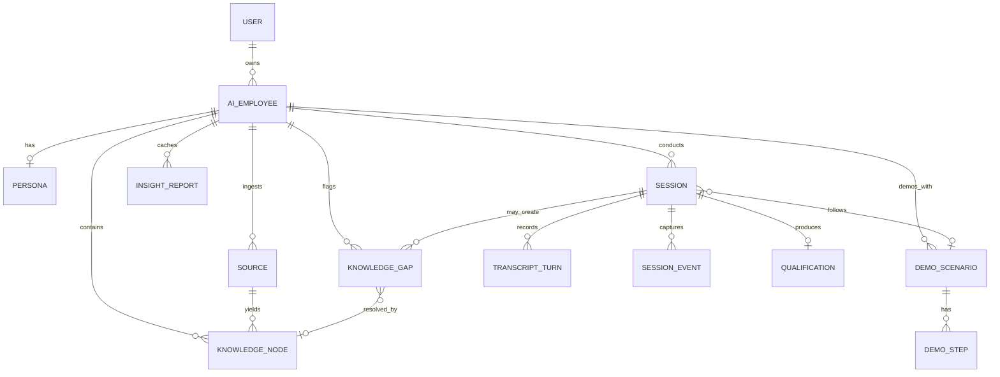

# Schema: Sable clone(AIライブデモ社員)

- Prisma + PostgreSQL。全モデルは teardown.md セクション5のエンティティ由来(対応をコメントで明記)
- 金額・課金モデルは存在しない [USER-REQ: 課金は作らない]

## Prisma Schema

```prisma
generator client {
  provider = "prisma-client-js"
}

datasource db {
  provider = "postgresql"
  url      = env("DATABASE_URL")
}

// ===== 認証(teardown: ORGANIZATION/MEMBER を単一ユーザーに簡約)=====
// [ASSUMED: メール+パスワード認証。SSOはout_of_scope。octolane specと同判断(E2E決定性)]
model User {
  id           String       @id @default(cuid())
  email        String       @unique
  passwordHash String
  name         String
  createdAt    DateTime     @default(now())
  aiEmployees  AiEmployee[]
}

// ===== AI社員(teardown: AI_EMPLOYEE)=====
model AiEmployee {
  id           String        @id @default(cuid())
  ownerId      String
  owner        User          @relation(fields: [ownerId], references: [id])
  name         String        // 管理用表示名(例: "Notion用デモ担当")
  productName  String        // デモ対象の製品名
  productUrl   String        // デモ対象の製品URL(Brain自動構築の起点)
  slug         String        @unique // 買い手向けURL /d/[slug]
  status       EmployeeStatus @default(DRAFT)
  brainStatus  BrainStatus   @default(EMPTY)
  createdAt    DateTime      @default(now())
  updatedAt    DateTime      @updatedAt

  persona        Persona?
  sources        Source[]
  knowledgeNodes KnowledgeNode[]
  knowledgeGaps  KnowledgeGap[]
  scenarios      DemoScenario[]
  sessions       Session[]
  insightReports InsightReport[]
}

enum EmployeeStatus {
  DRAFT      // 作成中(買い手アクセス不可)
  PUBLISHED  // 共有リンク有効
}

enum BrainStatus {
  EMPTY
  BUILDING
  READY
  FAILED
}

// ===== ペルソナ(teardown: PERSONA)=====
// [USER-REQ: 簡易アバターを必ず持つ。フォトリアルは不要]
model Persona {
  id           String       @id @default(cuid())
  aiEmployeeId String       @unique
  aiEmployee   AiEmployee   @relation(fields: [aiEmployeeId], references: [id], onDelete: Cascade)
  displayName  String       @default("Sana") // 買い手に見せる名前 [ASSUMED: デフォルト名]
  avatarPreset AvatarPreset @default(CIRCLE_A)
  accentColor  String       @default("#6C5CE7") // アバター背景・UIアクセント
  tone         Tone         @default(FRIENDLY)
  languages    String[]     @default(["ja", "en", "zh", "es"]) // 対応言語 [USER-REQ: 多言語即時切替]
  greeting     Json         // 言語別挨拶文 {"ja": "...", "en": "...", ...}
}

enum AvatarPreset {
  CIRCLE_A // 幾何学フェイスA(SVGアニメーション)
  CIRCLE_B
  ROBOT
  SPARK
}

enum Tone {
  FRIENDLY
  PROFESSIONAL
  ENERGETIC
}

// ===== Brain: 学習ソース(teardown: SOURCE)=====
model Source {
  id           String       @id @default(cuid())
  aiEmployeeId String
  aiEmployee   AiEmployee   @relation(fields: [aiEmployeeId], references: [id], onDelete: Cascade)
  type         SourceType
  name         String
  content      String?      @db.Text // テキスト抽出結果(URL取込・ファイル貼付とも)
  url          String?
  status       SourceStatus @default(PENDING)
  createdAt    DateTime     @default(now())
  knowledgeNodes KnowledgeNode[]
}

enum SourceType {
  PRODUCT_URL    // 製品サイト(AIF-001の起点)
  DOCUMENT       // ヘルプdocs・仕様書(テキスト貼付)
  CALL_RECORDING // 商談録音の文字起こしテキスト [ASSUMED: 音声ファイル処理はせずテキストで受ける]
  MARKETING      // マーケ資料
}

enum SourceStatus {
  PENDING
  PROCESSING
  READY
  FAILED
}

// ===== Brain: ナレッジ(teardown: KNOWLEDGE_NODE)=====
model KnowledgeNode {
  id           String        @id @default(cuid())
  aiEmployeeId String
  aiEmployee   AiEmployee    @relation(fields: [aiEmployeeId], references: [id], onDelete: Cascade)
  kind         KnowledgeKind
  title        String        // 例: "料金体系" / "競合Xとの違い"
  body         String        @db.Text // 回答の根拠となる本文(言語は原文ママ。応答時にAIが翻訳)
  sourceId     String?
  source       Source?       @relation(fields: [sourceId], references: [id], onDelete: SetNull)
  isEdited     Boolean       @default(false) // 人間が修正したノードはAIF-001の再構築で上書きしない
  createdAt    DateTime      @default(now())
  updatedAt    DateTime      @updatedAt
  resolvedGaps KnowledgeGap[]
}

enum KnowledgeKind {
  FEATURE   // 機能説明
  FAQ       // 想定問答
  OBJECTION // オブジェクションハンドリング
  OTHER
}

// ===== Brain: 知識ギャップ(teardown: KNOWLEDGE_GAP / INSIGHT)=====
model KnowledgeGap {
  id             String     @id @default(cuid())
  aiEmployeeId   String
  aiEmployee     AiEmployee @relation(fields: [aiEmployeeId], references: [id], onDelete: Cascade)
  question       String     // 答えられなかった買い手の質問(原文)
  language       String     // 質問された言語
  sessionId      String?
  session        Session?   @relation(fields: [sessionId], references: [id], onDelete: SetNull)
  status         GapStatus  @default(OPEN)
  resolvedNodeId String?
  resolvedNode   KnowledgeNode? @relation(fields: [resolvedNodeId], references: [id], onDelete: SetNull)
  createdAt      DateTime   @default(now())
}

enum GapStatus {
  OPEN
  RESOLVED
}

// ===== デモシナリオ(teardown: LIVEBOX_ENV/DEMO_SCENARIO を簡約)=====
// LiveBox(VM)の代替: バンドルされたサンプル製品 or 埋込可能URLを iframe 表示し、
// ステップ定義(route+selector)に沿ってAIカーソルが動く [ASSUMED: teardown 8 Drop の代替方式]
model DemoScenario {
  id           String     @id @default(cuid())
  aiEmployeeId String
  aiEmployee   AiEmployee @relation(fields: [aiEmployeeId], references: [id], onDelete: Cascade)
  title        String
  isDefault    Boolean    @default(false)
  steps        DemoStep[]
  sessions     Session[]
  createdAt    DateTime   @default(now())
}

model DemoStep {
  id         String       @id @default(cuid())
  scenarioId String
  scenario   DemoScenario @relation(fields: [scenarioId], references: [id], onDelete: Cascade)
  order      Int
  title      String       // 例: "ダッシュボード概要"
  route      String       // デモステージiframeに表示するパス(例: /demo-target/dashboard)
  selector   String?      // ハイライト+カーソル移動先のCSSセレクタ(nullなら全景)
  narration  Json         // 言語別ナレーション {"ja": "...", "en": "...", "zh": "...", "es": "..."}
  @@unique([scenarioId, order])
}

// ===== セッション(teardown: SESSION/BUYER)=====
model Session {
  id           String        @id @default(cuid())
  aiEmployeeId String
  aiEmployee   AiEmployee    @relation(fields: [aiEmployeeId], references: [id], onDelete: Cascade)
  scenarioId   String?
  scenario     DemoScenario? @relation(fields: [scenarioId], references: [id], onDelete: SetNull)
  mode         SessionMode   @default(LIVE)
  buyerName    String?
  buyerCompany String?
  language     String        @default("ja") // 現在の会話言語(AIF-003が更新)[USER-REQ]
  status       SessionStatus @default(ACTIVE)
  currentStepOrder Int       @default(0)    // 0=未開始。デモ進行位置
  summary      String?       @db.Text       // AIF-005の要約(終了時)
  startedAt    DateTime      @default(now())
  endedAt      DateTime?

  turns         TranscriptTurn[]
  events        SessionEvent[]
  qualification Qualification?
  gaps          KnowledgeGap[]
}

enum SessionMode {
  LIVE
  REHEARSAL // 管理者のテスト通話。SCR-018の一覧・インサイト集計から除外
}

enum SessionStatus {
  ACTIVE
  ENDED
}

// ===== トランスクリプト(teardown: TRANSCRIPT_TURN)=====
model TranscriptTurn {
  id        String   @id @default(cuid())
  sessionId String
  session   Session  @relation(fields: [sessionId], references: [id], onDelete: Cascade)
  role      TurnRole
  text      String   @db.Text
  language  String   // このターンの言語
  stepOrder Int?     // このターン時点のデモステップ(リプレイ用)
  meta      Json?    // AI側: 参照したKnowledgeNode ID配列、gap記録有無 等(透明性表示用)
  createdAt DateTime @default(now())
}

enum TurnRole {
  BUYER
  AI
}

// ===== セッションイベント(teardown: BROWSER_EVENT/ENGAGEMENT_METRICS を簡約)=====
model SessionEvent {
  id        String        @id @default(cuid())
  sessionId String
  session   Session       @relation(fields: [sessionId], references: [id], onDelete: Cascade)
  type      SessionEventType
  payload   Json          // STEP_SHOWN: {order,title} / LANGUAGE_SWITCH: {from,to} / GAP_RECORDED: {gapId,question}
  createdAt DateTime      @default(now())
}

enum SessionEventType {
  SESSION_START
  STEP_SHOWN
  LANGUAGE_SWITCH
  GAP_RECORDED
  SESSION_END
}

// ===== 資格確認(teardown: QUALIFICATION。HANDOFFはout_of_scope)=====
model Qualification {
  id        String  @id @default(cuid())
  sessionId String  @unique
  session   Session @relation(fields: [sessionId], references: [id], onDelete: Cascade)
  useCase   String? // 会話から抽出した利用目的
  teamSize  String?
  timeline  String?
  interest  Int?    // 関心度 1-5 [ASSUMED: スコア尺度]
  summary   String  @db.Text
  createdAt DateTime @default(now())
}

// ===== インサイト(teardown: INSIGHT。AIF-006の生成結果キャッシュ)=====
model InsightReport {
  id           String     @id @default(cuid())
  aiEmployeeId String
  aiEmployee   AiEmployee @relation(fields: [aiEmployeeId], references: [id], onDelete: Cascade)
  payload      Json       // {topQuestions: [{question, count, answered}], stumbles: [...], suggestions: [...]}
  generatedAt  DateTime   @default(now())
}
```

## ER図



## シード(E2E決定性のため必須)

- デモユーザー: `demo@example.com` / `demo1234`
- AI社員1体: productName「TaskFlow」(バンドルのサンプル製品)、slug `taskflow-demo`、status PUBLISHED、brainStatus READY
- Persona: displayName「Sana」、CIRCLE_A、languages ["ja","en","zh","es"]、言語別greeting
- KnowledgeNode 8件(FEATURE×4, FAQ×3, OBJECTION×1。サンプル製品TaskFlowの機能・料金FAQ等)
- DemoScenario 1本(isDefault)+ DemoStep 4件(/demo-target/ 配下のroute+selector+4言語narration)
- ENDEDなSession 2件(トランスクリプト・イベント・Qualification付き。各セッションにOPENなKnowledgeGapを1件ずつ=計2件。
  片方はE2E-014の解消対象、もう片方はE2E-015の未回答クラスタ用)
  → SCR-018/019/020 が初期状態から動作確認できる
```
