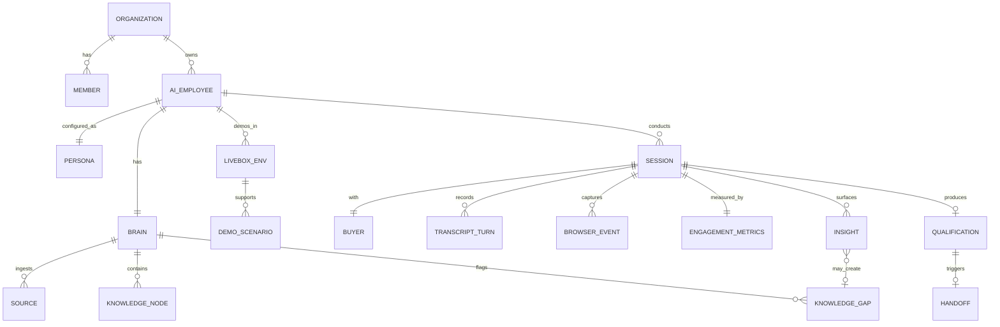

# Teardown: Sable (Aidan — リアルタイム対話型AI社員 / AIデモスペシャリスト)

- source_urls:
  - https://withsable.com/ (直接アクセス不可・403 — プロキシのネットワークポリシーによる。検索インデックス経由で内容把握)
  - https://versatile-talk-656688.framer.app/ (LPのFramerソース。同上403。タイトル「Sable: Let your product speak for itself」)
  - https://app.withsable.com/auth/signin (管理プラットフォーム。タイトル「Sable Platform」)
  - https://demo.withsable.com/ (「Talk to Sable: Live Demo of Our Platform」— 自社製品を自社AIがデモする体験ページ)
  - https://www.newswire.com/news/sable-raises-45m-to-build-the-first-ai-employee-that-can-click-see-and-explain (資金調達PR、2026-07-16)
  - https://fortune.com/2026/07/16/ai-employee-that-convinced-sequoia-to-invest-45-million-in-sable-shaun-maguire/
  - https://thenextweb.com/news/sable-aidan-ai-employee-sequoia-45-million
  - https://www.calcalistech.com/ctechnews/article/sk3tx8lngg (CTech / Calcalist)
  - https://apps.apple.com/us/app/sable-ai/id6759326642 (iOSアプリ「Sable.ai」)
- date: 2026-07-17
- user_requirements: 別プロダクト(octolaneとは独立)としてクローンする。まずバリュープロップの整理を優先 [USER-REQ]
- confidence: **medium** — 公式LP・アプリに直接アクセス不可(環境のネットワークポリシーで403)。
  資金調達PR(公式発表文)・Fortune/TNW/CTechの取材記事・検索インデックスからの再構成。
  ポジショニング・機能セット・固有名詞(Aidan / LiveBox / Brain / Interactive Intelligence)は複数ソースで一致しており信頼度高。
  **画面構成と価格は推定を含む**(価格は非公開のエンタープライズ営業モデルと推定)。

## 1. Positioning

**「デモ〜オンボーディングのパイプライン全体を置き換えるAI社員」**:
B2Bソフトウェア企業向けに、リアルタイムの computer use(ブラウザ操作)・vision・voice・video を備えた
AI社員「Aidan」が、買い手との商談通話・製品デモ・オンボーディングを24時間・全言語で実施する。
チャットボット(受け身・テキスト)への対抗ではなく、**人間のデモスペシャリスト/セールスエンジニアの代替**。

- ターゲット: 高成長〜大企業のB2Bソフトウェア企業のGTMチーム(初期顧客: Notion、Decagon、大手上場企業)
- 解く課題: 「全ての買い手に人間並みのライブデモ体験を提供するのはスケールしない」。
  SDRの資格確認→デモ担当→ソリューションエンジニア→CSオンボーディングと分断された購買体験を、
  文脈を持ち越す1人のAI社員で連続した体験にする(Aidanは4役を1人で吸収すると主張)
- タグライン: **"Let your product speak for itself"**(製品自身に語らせろ)
- コアコンセプト:
  - **Interactive Intelligence**: リアルタイムブラウザ操作+vision+voice+videoの統合。AIが「見て、クリックして、説明して、共同作業する」
  - **LiveBox**: Aidan専用のVM(仮想マシン)ワークスペース。共有ブラウザ画面の中でAidanが実際に製品を操作し、買い手も横でクリックできる
  - **Brain**: トップセラーの商談録音・社内エキスパートのインタビュー・ドキュメント・マーケ資料から構築する企業単位の統合コンテキストグラフ。継続学習(知識ギャップ検出・成功パターン獲得)
- 会社: 2025年10月創業(調査時点で1年未満)。創業者 Nim Ravid(CEO)、Leon Chen、Linda He、Itamar Rocha(Harvard出身、SpaceX/Google/Meta/Together AI経験者)。
  $45M調達(2026-07-16発表、Sequoia Capital・8VCリード、BoxGroup/SV Angel/Valor Atreides AI Fund等参加)
- 投資家の評価軸: Sequoia の Shaun Maguire「英語でデモ中に中国語・スペイン語へシームレスに切替」「Stripeが決済でやったことを想起させた」

## 2. Feature Map

- **リアルタイムAI社員「Aidan」(通話体験)** ★コア
  - 音声会話(自然な発話、割り込み対応)+ 顔(アバター/digital human)+ ビデオ ★
  - リアルタイムブラウザ操作: 画面を「見て」カーソルを動かし、クリックし、製品を実演 ★
  - 共有環境(co-browsing): 買い手が同じ画面を見ながら一緒にクリックできる ★
  - 画面変化への即応: ページの変化を認識し、説明を動的に調整(台本ボットではない) ★
  - 多言語: 会話の途中で言語を切替(英語→中国語→スペイン語のデモが投資判断の決め手)
  - 複雑な質問へのリアルタイム回答(Brainを参照)
  - 人間へのエスカレーション/ハンドオフ [ASSUMED: エンタープライズ導入の必須要件のため]
- **LiveBox(デモ実行環境)** ★コア
  - Aidan専用VM。顧客製品のフル機能をデモできるサンドボックス
  - デモ用シードデータ/シナリオ設定 [ASSUMED: デモの再現性確保に必須]
- **Brain(コンテキストレイヤー)** ★コア
  - 取り込み: 商談録音・エキスパートインタビュー・ドキュメント・スライド・ヘルプdocs・マーケ資料
  - 統合コンテキストグラフ化(enterprise customer context graph)
  - 継続学習: 知識ギャップの自動検出、成功した対話パターンの獲得、回答精度・会話品質の自動改善 ★
- **カスタマイズ**: AI社員の外見・トーン・振る舞いをブランドに合わせて設定
- **計測・インサイト** ★コア
  - 全セッションのエンゲージメント計測、フィードバック収集
  - インサイト抽出(買い手のつまずき・頻出質問・購買シグナル)
  - 資格確認(qualification)結果の出力 [ASSUMED: SDR役の吸収を主張しているため]
- **プラットフォーム(app.withsable.com)**: AI社員を「構築・監視・継続改善」する管理画面 ★
- **導入**: インテグレーション不要、数日で本番稼働(「no integrations required」)
- **ユースケース**: 商談デモ・資格確認 / オンボーディング / 新機能ローンチ / パートナー認定 / ユーザー教育 / 新人研修 / 国際展開
- **モバイル**: iOSアプリ「Sable.ai」あり [要確認: 用途(管理用か通話用か)不明]
- エンタープライズセキュリティを主張 [要確認: SOC 2等の認証名は未確認]

## 3. Screen Inventory

直接観測不可のため、機能セット・報道記述・URL構造(withsable.com / app.withsable.com / demo.withsable.com)からの再構成。
[ASSUMED] = 存在はほぼ確実だが構成は推定。

### 買い手側(Buyer-facing)

| ID | Screen | Purpose | Key UI | Nav to |
|---|---|---|---|---|
| SCR-001 | デモ入口ページ | 買い手がAidanとの通話を開始(demo.withsable.com型。ベンダーサイト埋込 or 共有リンク) | 「Talk to Aidan」CTA、マイク/カメラ許可、名前・会社入力 [ASSUMED] | SCR-002 |
| SCR-002 | ライブ通話画面 ★ | Aidanとのリアルタイムデモセッション | 共有ブラウザ(LiveBox画面)、Aidanのアバター+音声、字幕/チャット併用、言語切替、買い手側カーソル | SCR-003 |
| SCR-003 | 通話終了/フォローアップ | 要約・次のアクション提示 | セッション要約、資料リンク、人間との商談予約CTA [ASSUMED] | - |

### 管理側(app.withsable.com)

| ID | Screen | Purpose | Key UI | Nav to |
|---|---|---|---|---|
| SCR-010 | サインイン | 認証(/auth/signin を確認) | メール/SSO [ASSUMED: エンタープライズ向けのためSSO想定] | SCR-011 |
| SCR-011 | オンボーディング/AI社員作成 ★ | 数日で稼働開始させる初期設定ウィザード | 会社情報、製品URL、ソースアップロード誘導 | SCR-012,014 |
| SCR-012 | Brain: ソース管理 ★ | 学習素材の取込・管理 | 録音/動画/スライド/docsのアップロード、URL取込、処理ステータス | SCR-013 |
| SCR-013 | Brain: ナレッジビュー | コンテキストグラフの可視化・編集 | トピック/エンティティ一覧、知識ギャップ警告、Q&A修正 | SCR-012 |
| SCR-014 | LiveBox設定 ★ | デモ環境(VM)の構築・管理 | 製品ログイン情報、シードデータ、デモシナリオ定義、環境スナップショット [ASSUMED] | SCR-015 |
| SCR-015 | ペルソナ設定 | Aidanの外見・声・トーン・言語の設定 | アバター選択、音声プレビュー、トーン/挙動ガイドライン、対応言語 | - |
| SCR-016 | シミュレーション/リハーサル | 公開前にAidanを試す | テスト通話起動、想定質問での応答確認 [ASSUMED: 「build, monitor, improve」の build に対応] | SCR-002 |
| SCR-017 | 配備(Deploy) | 買い手向け入口の発行 | 共有リンク、サイト埋込スニペット、CTA設定 [ASSUMED] | SCR-001 |
| SCR-018 | セッション一覧 ★ | 全通話の監視 | セッションリスト(買い手/時刻/時間/言語/ステータス)、フィルタ | SCR-019 |
| SCR-019 | セッション詳細/リプレイ ★ | 個別通話の分析 | 録画リプレイ、トランスクリプト、エンゲージメント指標、資格確認サマリー、ハイライト | SCR-018 |
| SCR-020 | インサイトダッシュボード ★ | 全体傾向と改善提案 | 頻出質問、つまずきポイント、知識ギャップ一覧→Brain修正導線、コンバージョン指標 | SCR-013 |
| SCR-021 | ハンドオフ/リード | 資格確認済みリードの引き渡し | リード一覧、スコア、CRM連携 or CSVエクスポート [ASSUMED] | - |
| SCR-022 | 設定: チーム/権限 | メンバー管理 | 招待、ロール | - |
| SCR-023 | 設定: セキュリティ/課金 | エンタープライズ管理 | SSO設定、監査ログ、プラン [ASSUMED] | - |

## 4. User Flows

- **F1 買い手のライブデモ(コア体験)**: SCR-001(入口→マイク許可)→ SCR-002(Aidanが挨拶→ニーズヒアリング(資格確認)→LiveBoxで製品を操作しながらデモ→質問に即答→買い手も操作に参加→必要なら言語切替)→ SCR-003(要約+次アクション)
- **F2 AI社員の立ち上げ(管理者・数日)**: SCR-010 → SCR-011(ウィザード)→ SCR-012(商談録音・docs・マーケ資料を投入)→ 自動でBrain構築 → SCR-014(LiveBoxに製品環境を用意)→ SCR-015(外見・トーン設定)→ SCR-016(リハーサル)→ SCR-017(リンク/埋込を発行)
- **F3 監視→改善ループ(継続運用)**: SCR-018(セッション監視)→ SCR-019(リプレイ・指標確認)→ SCR-020(知識ギャップ・頻出質問を確認)→ SCR-013(Brainを修正/ソース追加)→ 自動で応答品質が向上
- **F4 資格確認→人間へのハンドオフ**: SCR-002(Aidanが会話中にICP適合・予算・時期を把握)→ SCR-021(スコア付きリードとして営業に引き渡し、通話要約添付)[ASSUMED]
- **F5 オンボーディング用途**: 既存顧客がSCR-001相当の入口から接続 → Aidanが顧客のアカウント文脈を踏まえ、実画面を一緒に操作しながらセットアップを完了させる [ASSUMED: ユースケースとして明言されているがフロー詳細は推定]

## 5. Data Model (estimated)

- SOURCE: type(call_recording | interview | doc | slide | marketing | url), 処理ステータス
- KNOWLEDGE_NODE: コンテキストグラフのノード(製品機能・FAQ・オブジェクション・成功トーク)
- BROWSER_EVENT: LiveBox内のナビゲーション/クリック/画面状態(リプレイと分析の基礎)
- ENGAGEMENT_METRICS: 発話比率、質問数、滞在、感情 [ASSUMED]

## 6. Pricing

- 公開価格なし。「book a demo」型のエンタープライズ営業モデル [要確認]
- 課金軸の候補: AI社員数 / セッション数(通話分数) / 年間契約 [ASSUMED: 同カテゴリ(Decagon等の会話AI)の慣行から推定]
- 無料枠: 不明。demo.withsable.com で自社製品のデモ体験のみ公開 [要確認]

## 7. AI-Native Opportunities(クローンで「AIが主語」を徹底する点)

対象がすでにAIネイティブなので、ここでは「Sableがまだ人間に残している運用作業」をAIに移す機会を挙げる:

1. **Brainのゼロタッチ構築**: Sableは録音・docsの投入を人間に要求する。クローンでは製品URLだけ渡せばAIがLP・docs・changelog・ヘルプをクロールし、デモ台本と想定Q&Aまで自動生成(投入素材は「追加の上書き」に格下げ)
2. **デモシナリオの自動生成・自己修復**: LiveBox内の製品UIが変わるとデモが壊れる。AIが毎日デモをリハーサル実行し、壊れたステップを自分で検知して経路を再学習(self-healing demo)
3. **ICP別デモの自動分岐**: 会話冒頭の資格確認結果から、AIがその場でデモシナリオ自体を組み替える(業種別シードデータの自動選択まで)
4. **インサイト→アクションの自律実行**: 「頻出質問トップ5」を表示するだけでなく、AIがBrainへの回答追加・LP改善提案・営業向け週次ブリーフを自動起票し、承認1クリックで反映
5. **フォローアップの自律実行**: 通話後の要約メール・試用環境の発行・人間商談の日程調整までAIが完結(passive capture: 通話内容から次アクションを勝手に用意し承認を待つ)
6. **知識ギャップの能動的解消**: 答えられなかった質問をAIが社内エキスパートにSlack等で自動インタビューし、回答をBrainに書き戻す(コンテキストレイヤーへの自動接続)
7. **セッションの横断学習**: 成約に至ったセッションの話法をAIが抽出し、全AI社員のペルソナ/台本に自動反映(A/Bまで自動)

## 8. Copy / Drop / Change

**Copy(そのまま真似る)**:
- 「共有ブラウザ+音声+アバター」のライブ通話UI(SCR-002)。このカテゴリの本質的発明であり体験の核
- Brain(ソース投入→統合ナレッジ→継続改善)の3層構造と、知識ギャップ→修正の改善ループ(F3)
- 「build → simulate → deploy → monitor → improve」の管理プラットフォーム構成
- 「インテグレーション不要・数日で稼働」のオンボーディング設計思想
- 資格確認〜デモ〜オンボーディングまで文脈を持ち越す「1人のAI社員」ナラティブ

**Drop(MVPでは捨てる)** [USER-REQ: 2週間MVPスコープを優先]:
- フォトリアルなdigital humanアバター(実装コスト大。静的アバター+口パクで代替)
- 本物のVM(LiveBox)のプロビジョニング。MVPはPlaywright制御のヘッドレスブラウザ+画面ストリーミングで代替
- ビデオ入力(買い手のカメラ映像理解)、iOSアプリ、パートナー認定・新人研修ユースケース
- 会話途中のリアルタイム言語切替(MVPは日英2言語の事前選択に縮小)

**Change(変える)**:
- 価格の透明化: 非公開エンタープライズ価格 → セルフサーブ+セッション課金の公開プライシング(下からの浸透を狙う)
- ターゲットの縮小: 大企業GTM → まず日本のB2B SaaSのデモ/オンボーディング [USER-REQ: 別プロダクトとして独自の立ち位置を取る]
- Brain構築の主語をAIに(セクション7-1): 「素材を集めて投入する」オンボーディングを「URLを1つ貼る」に
- ハンドオフ先を汎用化: 特定CRM連携ではなくWebhook+メール要約で開始

## 9. MVP Scope Proposal(2週間)

**「B2B SaaSのサイトに貼れる、製品を実演しながら喋るAIデモ担当者」**

- In:
  1. 管理側: 製品URL投入→AIが自動でナレッジ+デモ台本生成(SCR-011,012簡易版)、リハーサルモード(SCR-016)、共有リンク発行(SCR-017)
  2. 買い手側: 入口ページ→音声+チャットのライブセッション。Playwright駆動のブラウザ画面をWebRTC/画面キャストで共有し、AIがカーソル操作しながら音声で説明、質問に即答(SCR-001,002,003)
  3. 計測: セッション録画(イベントログ)+トランスクリプト+要約、頻出質問と未回答質問の一覧(SCR-018,019,020簡易版)
- Out: VMプロビジョニング、アバターのフォトリアル化、多言語即時切替、資格確認スコアリング、CRM連携、SSO/監査ログ
- 技術メモ: 音声はRealtime系API(STT/TTS統合)、ブラウザ操作はPlaywright+スクリーンキャスト、Brainは RAG(pgvector)で開始 [ASSUMED: 実装手段は仕様策定時に確定]

## Appendix: Open Questions [要確認]

1. **価格体系**: 完全非公開。課金軸(AI社員数/分数/セッション数)も未確認 → クローンの課金設計は独自判断になる
2. **LiveBoxの実体**: 「VM」とだけ公表。顧客製品のアカウント/データをどう用意するか(顧客がデモ環境を提供?Sableが構築代行?)は不明
3. **買い手側の操作権限**: 「買い手も横でクリックできる」の詳細(常時共同操作か、Aidanが許可した時だけか)
4. **人間へのエスカレーション**: 通話中のライブ転送があるのか、事後ハンドオフのみか
5. **SCR-010〜023の管理画面構成**: 全て機能からの逆算。実画面のスクショ・デモ動画が入手できれば精度が上がる
6. **セキュリティ認証**: 「enterprise security」の主張のみで、SOC 2 / GDPR等の具体的認証は未確認
7. **iOSアプリ「Sable.ai」の役割**: 管理者向け監視用か、通話クライアントか
8. **チャネル**: サイト埋込ウィジェットか、専用リンク(demo.withsable.com型)が主か、両方か
